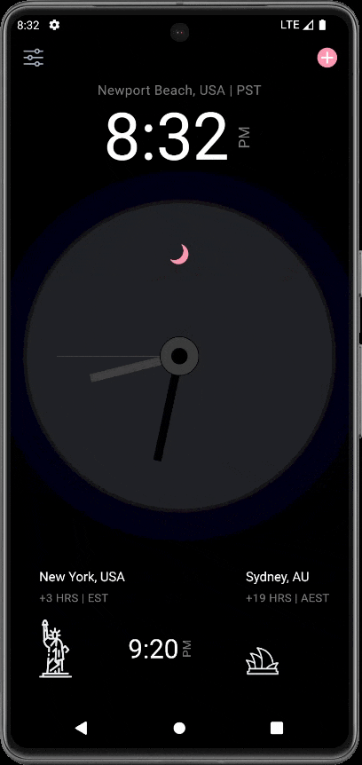
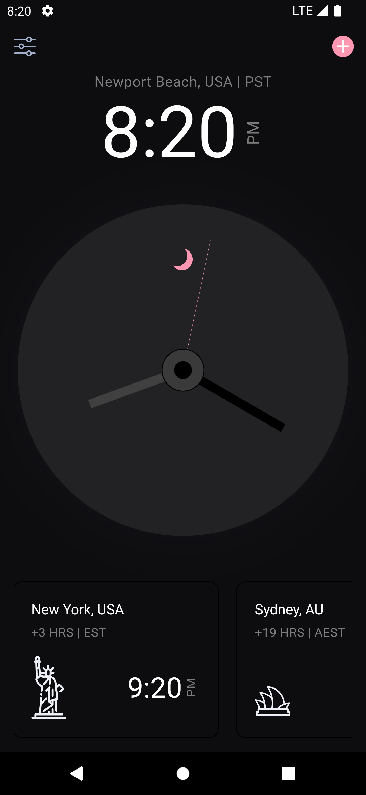
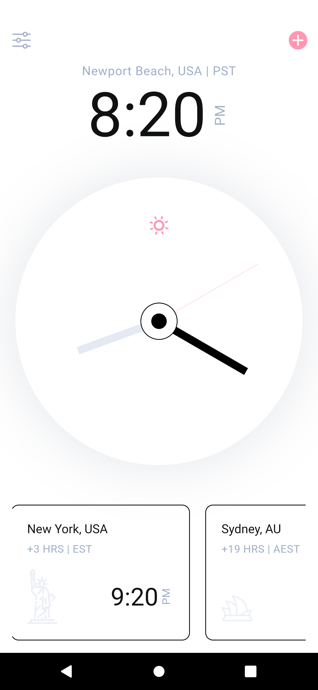

**3. FLUTTER ANALOG-CLOCK (LIGHT AND DART THEME)**
Welcome to the Flutter Analog-Clock.

This project is an actual working analog clock and not just a UI. It features both dark mode and light mode, automatically transitioning to dark mode at night and light mode during the day. However, if you wish to time travel to either daytime or nighttime, you can achieve that simply by tapping a button.

**Preview**

**Screenshots**

